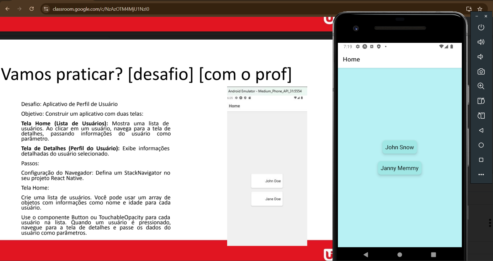

# Resultado do Desafio da aula03

# User do App

Este aplicativo em React Native exibe uma lista de usuários e permite visualizar detalhes de cada um. Ele foi desenvolvido utilizando navegação com o React Navigation e reprodução de áudio com o Expo AV.

## Estrutura do Projeto

O projeto contém os seguintes componentes principais:

1. **App.js**  
   Configura o aplicativo, utilizando `NavigationContainer` para gerenciar a navegação entre telas.

2. **AppNavigation.js**  
   Configura o stack navigator com as telas **HomeScreen** e **DetailsScreen**.

3. **HomeScreen.js**  
   Exibe uma lista de usuários, onde cada usuário é mostrado como um botão interativo.

    ## Imagem da aplicação rodando `Home` seleção de usuário
   
 
   - Pressionar o botão executa um som utilizando o Expo AV.  
   - Navega para a tela **DetailsScreen** passando os detalhes do usuário.

4. **DetailsScreen.js**  
   Exibe detalhes sobre o usuário selecionado, incluindo:  
   - Nome.  
   - Idade.  
   - Imagem de perfil baseada no gênero.  
   Imagens de perfil masculino e feminino estão armazenadas localmente na pasta `assets/images`.

    ## Imagem da aplicação rodando `Dado dos Usuários`

   

   

## Problemas Conhecidos

1. **Sombreamento inconsistente no Android**  
   - O estilo `shadow` funciona bem no iOS, mas no Android requer a propriedade `elevation`.  

2. **Reprodução de áudio no Expo Go**  
   - Certifique-se de que o arquivo de áudio na pasta `assets/sounds` está acessível e correto.

## Conclusão

Este projeto demonstra conceitos fundamentais como navegação, manipulação de eventos e integração de mídia no React Native. Personalizações futuras podem incluir persistência de dados e otimizações para diferentes plataformas.
